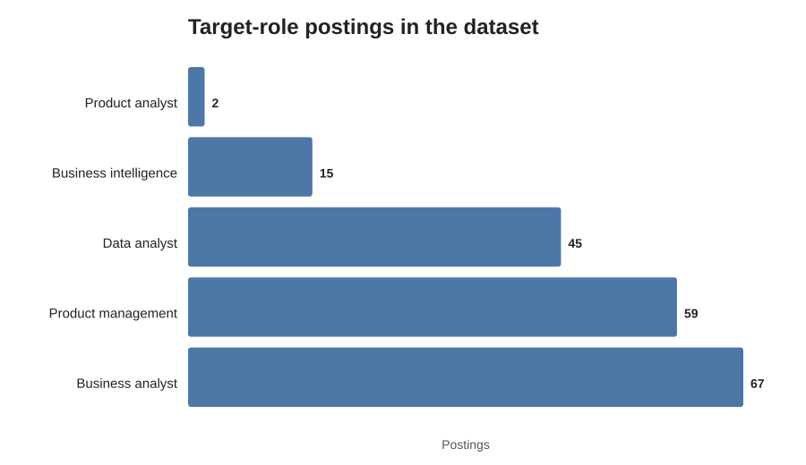
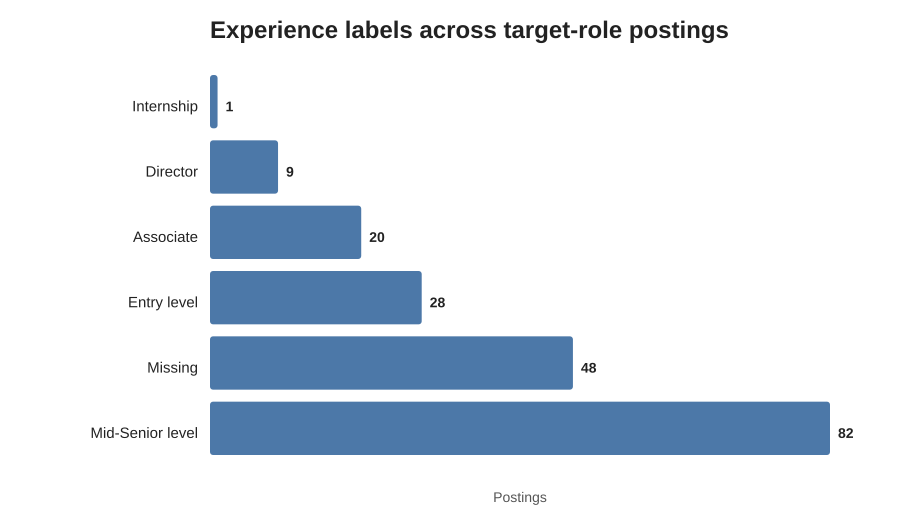
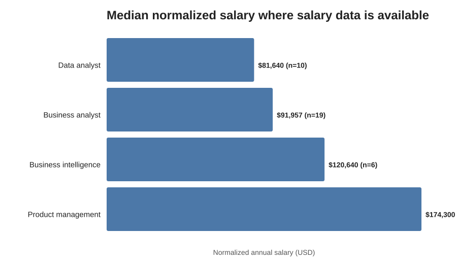
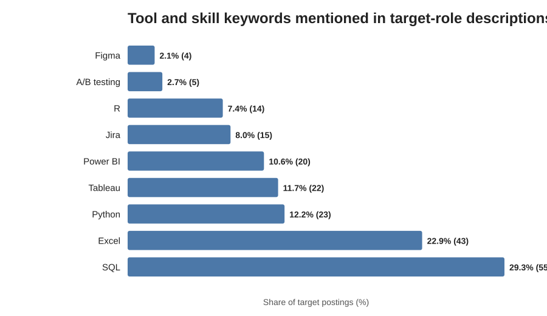

# Job Market & Skills Analysis

A compact exploratory analysis of analyst, product, and business-intelligence job postings, structured around the same workflow I use in coursework: research question → data overview → cleaning → exploratory analysis → interpretation → limitations.

## Research question

**What do analyst, product, and business-intelligence job postings actually ask for, and how do role family, experience level, salary, and tool requirements differ across them?**

I was especially interested in a practical version of this question: which adjacent role families appear most often, how “entry level” they really are, what tools recur in descriptions, and how compensation differs across the sample.

## Data overview

The repository contains a relational-style set of CSV files built around LinkedIn job postings:

- `postings.csv` — job-level information including title, description, location, experience label, and normalized salary
- `companies.csv` — company-level information
- `job_skills.csv` + `skills.csv` — job-to-skill-category mapping
- `job_industries.csv` + `industries.csv` — job-to-industry mapping
- `salaries.csv` — compensation records

The current `postings.csv` contains **14,681 postings**. For this analysis, I filtered titles into five role families that match the scope of the project: Business Analyst, Data Analyst, Product Management, Business Intelligence, and Product Analyst. That produced **188 target-role postings**.

> The analysis is exploratory. The dataset is a snapshot of postings rather than a complete census of the labor market.

## Analysis workflow

The notebook (`JobMarketAnalysis.ipynb`) follows the same structure as my class analysis work:

1. define the research question
2. inspect the data and relevant columns
3. clean and classify titles into comparable role families
4. examine missingness and salary coverage
5. explore distributions with visualizations
6. compare experience, compensation, and tool mentions
7. interpret findings with limitations

## Exploratory analysis

### 1. Which role families appear most often?



Among the 188 postings captured by the title rules, **Business Analyst (67)** and **Product Management (59)** were the largest groups, followed by **Data Analyst (45)** and **Business Intelligence (15)**. Only **2 Product Analyst** titles were captured, so that category is too small for strong comparisons.

### 2. How “entry level” is this slice of the market?



The most common explicit experience label was **Mid-Senior level (82 postings, 43.6%)**. Only **28 postings (14.9%)** were labeled Entry level, while **48 postings (25.5%)** had no experience label at all.

The mix differed sharply by role family. Data Analyst was the most early-career-heavy group in this sample: **19 of 45 postings (42.2%)** were labeled Entry level. By comparison, only **5 of 67 Business Analyst postings (7.5%)** and **4 of 59 Product Management postings (6.8%)** carried that label.

This does **not** mean those percentages describe the whole labor market. They describe this dataset and the title rules used here.

### 3. How does salary differ by role family?



Salary coverage is incomplete, so these medians should be treated as descriptive rather than definitive. Among postings with usable normalized salary values:

- Product Management: **$174,300 median** (`n=23`)
- Business Intelligence: **$120,640 median** (`n=6`)
- Business Analyst: **$91,957 median** (`n=19`)
- Data Analyst: **$81,640 median** (`n=10`)

The Product Management figure is especially likely to reflect the seniority mix: half of the Product Management postings in this sample were Mid-Senior or Director-level. I therefore treat the chart as a description of observed postings, not evidence that role title alone causes higher pay.

### 4. What tools and analytical skills show up in descriptions?

I searched the text of the 188 target-role descriptions for a small set of common tools and analytical terms.



The most frequently mentioned keyword was **SQL (55 postings, 29.3%)**, followed by **Excel (43, 22.9%)**, **Python (23, 12.2%)**, **Tableau (22, 11.7%)**, and **Power BI (20, 10.6%)**.

The pattern also changes by role:

- SQL appeared in **37.8% of Data Analyst** descriptions and **66.7% of Business Intelligence** descriptions.
- Excel appeared in **28.9% of Data Analyst** and **46.7% of Business Intelligence** descriptions.
- Product Management descriptions mentioned SQL less often (**18.6%**) but showed a broader mix including Tableau, Python, R, Jira, and A/B testing.

Keyword matching is intentionally simple and only detects literal mentions. A posting can require an analytical capability without using one of these exact words.

## Main findings

**1. The role label matters because the seniority mix is very different.**  
A large share of the Product Management and Business Analyst postings in this sample are not explicitly early-career, while Data Analyst has a much larger Entry-level share.

**2. SQL is the strongest recurring technical signal across the target roles.**  
It appears across analyst, BI, and product postings rather than being confined to a single title family.

**3. Salary comparisons are inseparable from seniority and missing-data issues.**  
Product Management has the highest observed median salary, but it also has a much more senior experience distribution. A role-level salary ranking without that context would be misleading.

**4. Adjacent roles overlap, but not identically.**  
Business Intelligence is the most tool-dense category in the keyword scan, while Product Management mixes technical and coordination/product terms. That supports treating these roles as related but not interchangeable.

## Data cleaning appendix

The notebook documents the cleaning decisions directly. The main choices were:

- select only columns needed for the research question rather than loading every field into the working dataframe
- normalize title text to lowercase for classification
- assign role family using explicit title patterns
- keep missing experience labels as `Missing` instead of silently dropping them
- use `normalized_salary` only when it is numeric and greater than zero
- count tool mentions from description text using explicit regular expressions
- report sample sizes alongside salary summaries

The title classifier is deliberately conservative. For example, a generic “Analyst” title is not automatically treated as a Data Analyst or Business Analyst.

## Data description

### Motivation

The project started from a practical question: job titles that sound adjacent can have very different expectations. I wanted to use the posting data to see how role family, seniority, compensation, and tools actually vary rather than treating “analyst” or “product” as one market.

### Composition

The analysis uses job-level posting records and links them conceptually to skill, company, industry, and salary tables. The primary exploratory notebook focuses on the posting table plus description text because those fields directly support the research question.

### Collection process

The CSV files are the dataset currently included in this repository. This analysis does not attempt to reconstruct LinkedIn’s ranking or recommendation systems; it works only with the posting records available in the dataset.

## Limitations

- The dataset is a snapshot, not the full current job market.
- Title-based role classification is imperfect and intentionally conservative.
- `formatted_experience_level` is missing for 48 of the 188 target postings.
- Salary data is available for only a subset of postings and mixes role seniority.
- `normalized_salary` depends on the source dataset’s normalization method.
- Keyword counts measure literal mentions in descriptions, not actual proficiency requirements.
- Product Analyst has only two captured postings, so it should not be compared statistically with the larger groups.
- The analysis is descriptive and does not establish causal relationships.

## Repository structure

```text
Job-Market-Skills-Analysis/
├── JobMarketAnalysis.ipynb
├── postings.csv
├── companies.csv
├── job_skills.csv
├── skills.csv
├── salaries.csv
├── job_industries.csv
├── industries.csv
├── schema.sql
├── analysis.sql
├── scripts/
│   └── clean_data.py
├── results/
│   ├── findings.md
│   └── charts/
│       ├── role_volume.svg
│       ├── experience_distribution.svg
│       ├── salary_by_role.svg
│       └── skill_keywords.svg
└── README.md
```

## Next step

A future presentation layer can turn these findings into a dark, board-style analytical dashboard with headline metrics, annotated charts, and interactive filters. The notebook remains the transparent analysis layer underneath it.
